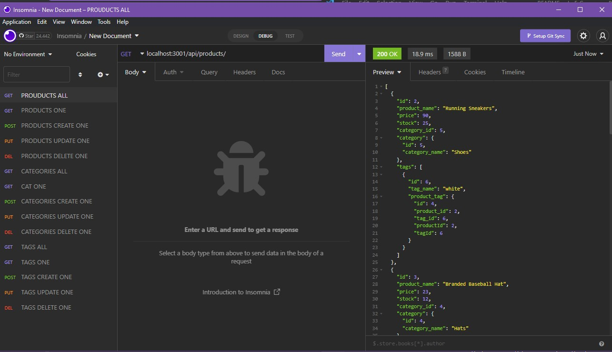

# E-Commerce Backend 🤑

## Description
Welcome to the E-Commerce Back end! This backend allows for API requests to be made to specific routes to allow for the creation, updating, reading and deleting of various categories, products, and tags for items of any sort. Something like this could be the backbone for an ecommerce website. This application uses sequelize to work with sql databases to manage columns and information. The challenges that came from working on this project largely stemmed from being sure the routes were being hit properly with the correct information.

### Table of contents
- [Description](#description)
- [Installation Instructions](#installation-instructions)
- [Usage Guidelines](#usage-guidelines)
- [Contact](#contact)

## Installation Instructions
To install, download the repo ```npm install``` to install required packages. After, source the ```schema.sql``` database using ```SOURCE schema.sql``` with an open mysql terminal running in the db directory. After you can seed the project using ```npm run seed``` from the home director. After that start ```npm start``` and it will run! Please see video demo.

## Usage Guidelines
To utilize this ecommerce backend, an application like insomnia must be used to hit correct API routes. See the video linked below for a demo. When running this locally, routes such as ```localhost:3001/api/tags/``` will return all tags, as ```localhost:3001/api/tags/2``` will return the tag with the id of 2. The same is true of categories, and products. Creation occurs with post, updates with put and deletion of specific products works as well. 

* ### Screenshots



[Please Click Here for Youtube Demo](https://www.youtube.com/watch?v=E1haxnn3R9M)

## Questions? Contact me

[Find me on GitHub](https://github.com/hburnton)

[Send me an email](mailto:hburnton@gmail.com)

[Project Page on Github](https://github.com/HBurnton/E-Commerce_Back_End)